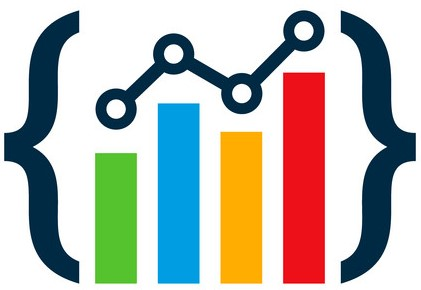

<h1 align="center">Hi 👋,  I'm Md. Naimur Rahman</h1>
<h3 align="center">A passionate Jr. MERN Stack Developer</h3>
 
  

  

🔭 Currently working on [University Management Auth](https://github.com/naimur61/university-management)

🌱 Actively learning **Mongoose** to enhance my skill set.

### About Me

💡 Always eager to learn and explore new technologies, staying ahead in the rapidly evolving world of web development.

🌟 Completed a comprehensive web development course at Programming Hero, refining my skills and gaining practical experience.

🚀 Passionate about turning ideas into reality through clean, efficient, and scalable code. Let's collaborate and build something amazing together!

🌱 Actively seeking new opportunities to contribute to exciting projects and further grow as a developer.

### Get in Touch

📫 Reach me at **m.naimur61@gmail.com.** Let's connect and share our knowledge!

🌐 Check out my portfolio website to explore recent projects and learn more about my skills and experiences: [Portfolio](https://naimur61.vercel.app)

### Fun Fact

⚡ I bring humor and passion to my job!

⚡ Fun fact **I am Funny and Passionate about my job**

## 🌐 Connect with me:

# 💻 Tech Stack:

 
 
<be>

    
# GitHub Stats 

    

 
 

### 🔝 Top Contributed Repo

